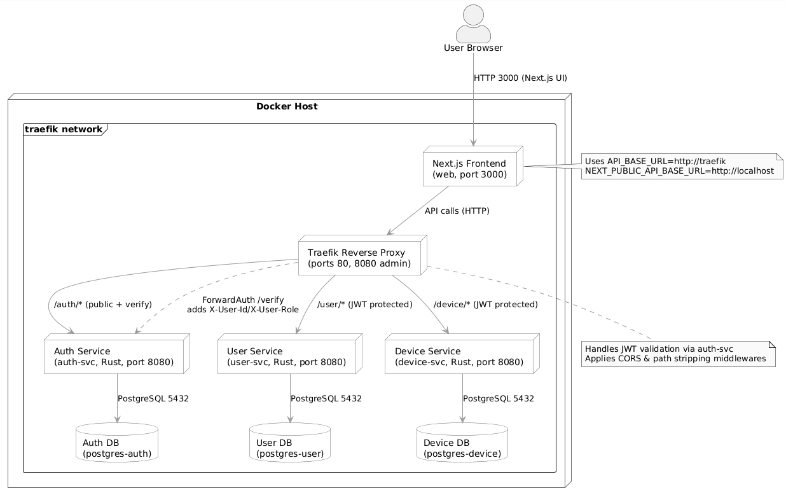

# Watt – An Energy Management System

## What is Watt
Still the same story: I wanted to understand how a “real” microservice setup feels, so I built one piece at a time. Watt is a small energy management platform with auth, users, devices, a Traefik gateway, and now a Next.js dashboard on top.



## Structure
Everything lives in Docker Compose. Right now we have:

- `auth-svc` (Rust + Axum) with its own Postgres database
- `user-svc` (Rust + Axum) with its own Postgres database
- `device-svc` (Rust + Axum) with its own Postgres database
- Traefik acting as reverse proxy + API gateway + JWT forward auth
- `web` (Next.js 16) for the dashboard/admin UI

Each service exposes a friendly `/health` route. Everything else goes through Traefik, which checks JWTs by calling `auth-svc /verify`.

## Technology
- Rust (Axum, sqlx)
- PostgreSQL (one instance per service)
- Traefik 3
- Next.js 16 (App Router, Tailwind)
- Docker + Docker Compose

## What you need before running
1. Docker Desktop / engine up and running
2. A `.env` file at the repo root. The template is:

   ```env
   POSTGRES_AUTH_DB=auth_db
   POSTGRES_AUTH_USER=auth_user
   POSTGRES_AUTH_PASSWORD=auth_pass
   POSTGRES_AUTH_PORT=5433

   POSTGRES_USER_DB=user_db
   POSTGRES_USER_USER=user_user
   POSTGRES_USER_PASSWORD=user_pass
   POSTGRES_USER_PORT=5434

   POSTGRES_DEVICE_DB=device_db
   POSTGRES_DEVICE_USER=device_user
   POSTGRES_DEVICE_PASSWORD=device_pass
   POSTGRES_DEVICE_PORT=5435

   JWT_SECRET=super-secret-key
   JWT_ISSUER=watt
   JWT_AUDIENCE=watt-clients
   ACCESS_TOKEN_TTL_SECONDS=3600

   NEXT_PUBLIC_API_BASE_URL=http://localhost
   API_BASE_URL=http://traefik
   ```
## How to run the whole thing
1. `docker compose up --build` (first boot pulls images and builds the Rust binaries + Next.js bundle)
2. Wait for the health checks to go green; `docker compose ps` helps
3. Visit `http://localhost:3000` for the dashboard
4. Traefik UI is at `http://localhost:8090` if you are curious

### Smoke test checklist
- `curl http://localhost/auth/health`
- `curl http://localhost/user/health`
- `curl http://localhost/device/health`
- Register a user via the UI (or Postman) → log in → dashboard shows profile + devices
- Admin accounts see the Admin tab with global CRUD

## Useful endpoints (through Traefik)

| Service     | Public                         | Protected (JWT)                                  |
|-------------|---------------------------------|--------------------------------------------------|
| auth-svc    | `GET /auth/health`<br>`POST /auth/login`<br>`POST /auth/register` | `POST /auth/verify` (forward-auth) |
| user-svc    | `GET /user/health`              | `GET /user/me`<br>`PUT /user/update`<br>`POST /user/create`<br>`GET /user/get_all` |
| device-svc  | `GET /device/health`            | `GET /device/read/all`<br>`PUT /device/update`<br>`POST /device/create` (admin)<br>`DELETE /device/delete/{id}` |

Frontend calls go through Traefik, so the server-side base URL is `http://traefik`. Browsers still hit `http://localhost`.

## Frontend
- Next.js App Router, Tailwind, React Hook Form + Zod
- Dashboard shows personal profile + devices (even for admins)
- Admin console has two tabs (Users, Devices) with CRUD 

## Roadmap / Notes
- RabbitMQ 
- Metrics/observability stack would be a nice next step
- CI pipeline is also on the TODO list

## License
MIT – see [LICENSE](LICENSE).
